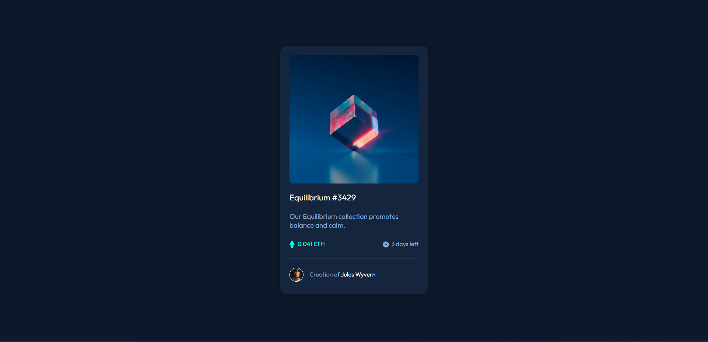

# Frontend Mentor - NFT preview card component solution

This is a solution to the [NFT preview card component challenge on Frontend Mentor](https://www.frontendmentor.io/challenges/nft-preview-card-component-SbdUL_w0U). Frontend Mentor challenges help you improve your coding skills by building realistic projects. 

## Table of contents

- [Overview](#overview)
  - [The challenge](#the-challenge)
  - [Screenshot](#screenshot)
  - [Links](#links)
- [My process](#my-process)
  - [Built with](#built-with)
  - [What I learned](#what-i-learned)
  - [Continued development](#continued-development)
  - [Useful resources](#useful-resources)
- [Author](#author)
- [Acknowledgments](#acknowledgments)

## Overview

### The challenge

Users should be able to:

- View the optimal layout depending on their device's screen size
- See hover states for interactive elements

### Screenshot

### Links

- Solution URL: [Add solution URL here](https://your-solution-url.com)
- Live Site URL: [Live Site](https://delone-femnft.netlify.app)

## My process

### Built with

- Semantic HTML5 markup
- CSS custom properties
- Flexbox

### What I learned

### Continued development

Accesssbility Applied Design

### Useful resources

- [StackOverflow](https://stackoverflow.com)
- [MDN](https://developer.mozilla.org/en-US/)

## Author

- Website - [Shin Thant Kaung](https://delonekg.github.io/personal-page)
- Frontend Mentor - [@delonealt](https://www.frontendmentor.io/profile/delonealt)
- Twitter - [@Deloneeeee](https://www.twitter.com/Deloneeeee)

## Acknowledgments

Keep on grinding! CSS is hard but it'll be easier if you keep working hard.